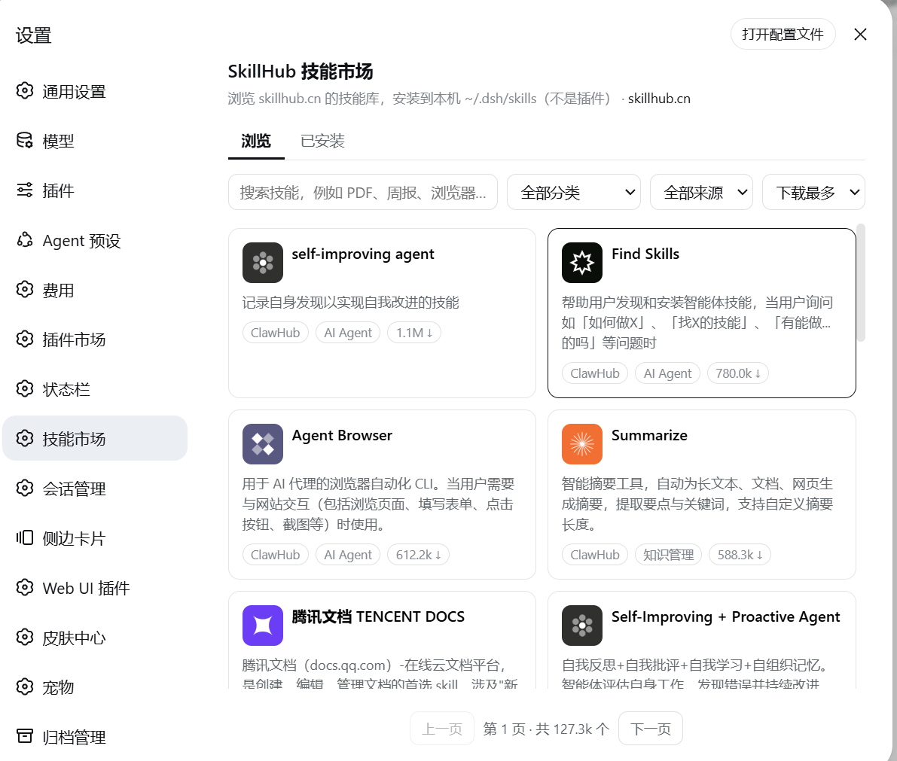

# dsh-skillhub

English | [中文](#中文)

A DeepSeek Harness plugin that adds **Settings → Skill Market**. It browses the public [skillhub.cn](https://skillhub.cn/) catalog and installs only the skills you pick into `~/.dsh/skills`.

This is a **skill** store, not a Cordis plugin store. Installed skills are ordinary `SKILL.md` bundles. The official filesystem skill provider picks them up without a restart.



## Install

```sh
dsh plugin --profile web add github:vonweller/dsh-skillhub
```

Restart `dsh web`, then open **Settings → Skill Market**.

## What it does

- Pages the public skillhub.cn catalog (search, category, source, sort)
- Shows security-scan labels, paid / API-key flags, and a `SKILL.md` preview
- One-click install / uninstall of the selected skill only
- Downloads `GET https://api.skillhub.cn/api/v1/download?slug=…` and unpacks it to `~/.dsh/skills/<name>/`

It does not dump the remote catalog into the model skill list.

## Optional config

Override the row in the profile `cordis.patch.yml`:

```yaml
- insert:
    - id: dsh-skillhub
      name: dsh-skillhub
      config:
        apiBase: https://api.skillhub.cn
        installDir: ~/.dsh/skills
```

## License

MIT

---

## 中文

DeepSeek Harness 插件：在 **设置 → 技能市场** 浏览 [skillhub.cn](https://skillhub.cn/) 的技能库，并把选中的技能安装到 `~/.dsh/skills/<name>/SKILL.md`。

这是 **技能** 市场，不是插件市场。已安装的技能由官方 `ctx.skills` 文件系统提供方自动发现，当前会话不用重启。


```sh
dsh plugin --profile web add github:vonweller/dsh-skillhub
```

重启 `dsh web`，打开设置左侧的 **技能市场**。

Install from a commit SHA if you want a pinned review copy.

